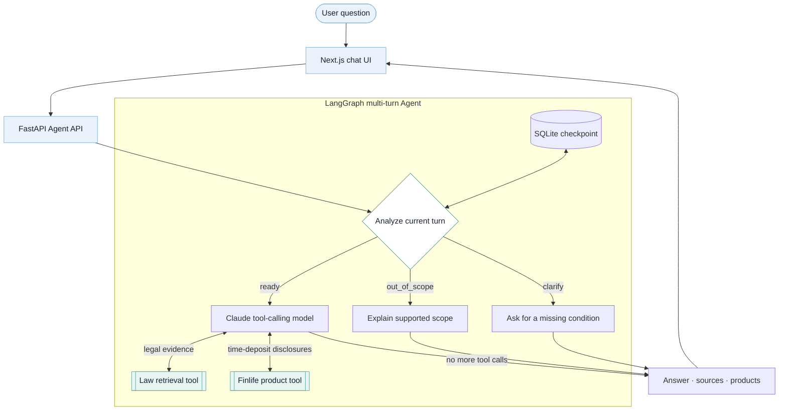

<p align="center">
  
</p>

<h1 align="center">Finbom</h1>

<p align="center">
  A multi-turn financial assistant that explains Korean laws and deposit products with evidence
</p>

<p align="center">
  <a href="README.md">한국어</a> · <strong>English</strong>
</p>

<p align="center">
  <a href="https://www.python.org/">
    
  </a>
  <a href="https://fastapi.tiangolo.com/">
    
  </a>
  <a href="https://docs.langchain.com/oss/python/langgraph/">
    
  </a>
  <a href="https://nextjs.org/">
    
  </a>
</p>

<p align="center">
  <a href="#financial-guidance-with-verifiable-evidence">Overview</a> ·
  <a href="#what-finbom-can-do">Features</a> ·
  <a href="#from-question-to-answer">Agent flow</a> ·
  <a href="#legal-data-and-retrieval-evidence">Data</a> ·
  <a href="#quick-start">Quick start</a> ·
  <a href="docs/README.md">Development docs (KO)</a>
</p>

---

## Financial guidance with verifiable evidence

For financial questions, verifying **which sources support an answer** matters as much as receiving
the answer itself. Finbom retrieves Korean depositor-protection and financial-consumer laws,
compares bank time-deposit candidates from Finlife disclosures, and presents the answer alongside
its evidence.

The friendly mascot **Poki** guides users through statutory provisions and product comparisons in
one continuous experience, without assuming familiarity with legal or developer tools.

## What Finbom can do

- **Explain legal grounds** — cites the law, article number, and effective date for questions about
  depositor protection and financial-consumer rights.
- **Compare time-deposit candidates** — sorts Finlife bank disclosures by term and either base or
  maximum interest rate.
- **Clarify missing conditions across turns** — asks for one missing condition at a time and keeps
  confirmed preferences in a SQLite checkpoint for the same consultation thread.
- **Combine laws and products** — lets the Agent use both tools when a question needs legal evidence
  and product candidates.
- **Handle unsupported topics explicitly** — routes unsupported questions to `out_of_scope` instead
  of inventing an unrelated answer.
- **Keep evidence visible** — streams status and answer updates while separating the answer, legal
  sources, and product data in the UI.

## From question to answer



Finbom first classifies the current turn as `clarify`, `out_of_scope`, or `ready`. For a ready
question, Claude decides whether and in which order to call the law-retrieval and time-deposit
tools, examines their outputs, and produces the final answer. The Next.js UI forwards requests
through `POST /api/chat` and consumes the FastAPI `/ask-agent/stream` SSE response.

## Legal data and retrieval evidence

The legal corpus is an XML snapshot collected from Korea's National Law Information Open API. It
currently covers four documents: the Financial Consumer Protection Act, the Depositor Protection
Act, and both enforcement decrees. The snapshot date is **2026-07-06**.

- [Legal XML sources and collection notes (KO)](data/laws/README.md)
- [Versioned legal source files](data/laws/)
- [RAG development and regression dataset (KO)](data/evaluation/README.md)

The Chroma index (`data/index/`) is a reproducible local artifact and is not committed. Build it
from the XML sources and inspect the stored article/chunk counts with:

```bash
uv run python scripts/build_index.py
uv run python scripts/verify_index.py
```

Time-deposit data is fetched at request time from the bank disclosures provided by Korea's Finlife
API. A deterministic Python comparison selects candidates by term and the requested interest-rate
criterion; the LLM does not reorder the ranking.

## Quick start

Finbom requires Python 3.13, [uv](https://docs.astral.sh/uv/), and Node.js 20.9 or later.

### One-time setup

```bash
cp .env.example .env  # skip when .env already exists
uv sync --locked
uv run python scripts/build_index.py
npm --prefix frontend ci
```

Keep the runtime keys together in the root `.env` file:

```dotenv
CHATBOT_BACKEND=anthropic
ANTHROPIC_API_KEY=<your-anthropic-api-key>
ANTHROPIC_MODEL=claude-haiku-4-5-20251001
FINLIFE_API_KEY=<your-finlife-api-key>
```

### Fastest way to run

After setup, start FastAPI and Next.js together with one command:

```bash
./scripts/run.sh
```

- Chat UI: `http://localhost:3001`
- FastAPI docs: `http://127.0.0.1:8000/docs`
- Stop both servers: `Ctrl+C`

### Run the servers separately

Use two terminals when you want separate logs:

```bash
# terminal 1
uv run fastapi dev
```

```bash
# terminal 2
npm --prefix frontend run dev
```

## Scope and limitations

- Finbom's answers and displayed legal or disclosure information are for reference only. They have
  no legal effect and do not constitute legal or financial advice. Verify current information and
  actual coverage with the relevant authority and financial institution.
- The legal corpus is a fixed snapshot and is not synchronized in real time.
- The current product tool supports **bank time deposits only**. General legal questions about
  savings products and retrieving savings-product disclosures are separate capabilities.
- Product comparisons are condition-based candidate lists, not personalized determinations of the
  best financial product.

## Next improvements

- Implement and regression-test hybrid retrieval that combines BM25 keyword search with the current
  vector search.
- Normalize and compare Finlife savings disclosures, then connect them to the Agent product tool.

Evaluation conditions, experiments, and implementation records are organized in the
[development documentation hub (KO)](docs/README.md).

## Repository layout

```text
korean-chatbot/
├── frontend/                 Finbom chat UI (Next.js, localhost:3001)
├── src/chatbot/              Agent, RAG, and FastAPI
├── data/laws/                Versioned legal XML snapshot
├── data/evaluation/          Development/regression datasets and fixtures
├── scripts/                  Run, collection, indexing, and verification commands
├── tests/                    Backend unit and flow tests
└── docs/                     Development, evaluation, and design notes
```

The initial [from-scratch Transformer implementation](experiments/from_scratch/README.md) is
preserved separately from the current application path.
