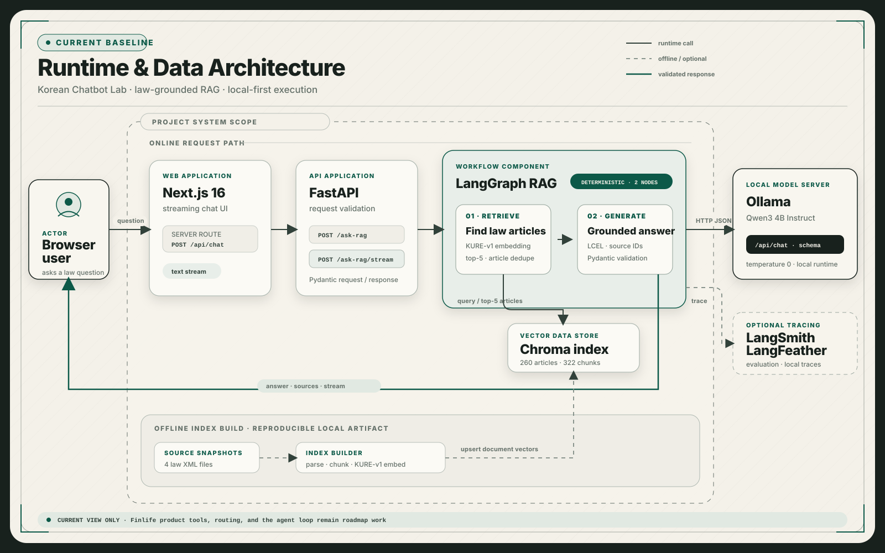

<p align="center">
  
</p>

<h1 align="center">금융안심 · Korean Chatbot Lab</h1>

<p align="center">
  한국 금융 법령에서 근거 조문을 찾고, 생성 모델로 쉽게 설명하는 RAG 챗봇
</p>

<p align="center">
  <a href="https://www.python.org/">
    
  </a>
  <a href="https://fastapi.tiangolo.com/">
    
  </a>
  <a href="https://python.langchain.com/">
    
  </a>
  <a href="https://docs.langchain.com/oss/python/langgraph/">
    
  </a>
  <a href="https://ollama.com/">
    
  </a>
  <a href="https://www.anthropic.com/api">
    
  </a>
  <a href="https://nextjs.org/">
    
  </a>
</p>

<p align="center">
  <a href="#핵심-기능">핵심 기능</a> ·
  <a href="#아키텍처">아키텍처</a> ·
  <a href="#빠른-시작">빠른 시작</a> ·
  <a href="#평가">평가</a> ·
  <a href="#로드맵">로드맵</a>
</p>

---

## 프로젝트 소개

금융안심은 예금자보호와 금융소비자 권리에 관한 질문을 현재 수집된 법령 안에서
검색하고, 답변을 뒷받침하는 법령명·조문·시행일을 함께 반환하는 로컬 RAG
(검색 증강 생성) 애플리케이션입니다.

핵심 경로는 법령 XML 수집부터 조문 단위 검색, 구조화된 답변 생성, FastAPI
스트리밍, Next.js 상담 화면까지 하나의 실행 가능한 흐름으로 연결되어 있습니다.
LangGraph 전환 전후에는 같은 24문항 Dataset으로 검색 결과가 유지되는지도
확인했습니다.

> 이 프로젝트의 답변은 학습·시연용입니다. 최신 법령, 개별 상품의 보호 여부와
> 금융 의사결정은 반드시 관계 기관의 공식 공시를 다시 확인해야 합니다.

> **현재 발전 단계 — Workflow → AI Agent**
>
> 지금은 `retrieve → generate` 두 노드가 정해진 순서로 실행되는 LangGraph
> Workflow입니다. 아직 모델이 Tool 사용과 반복 여부를 스스로 선택하는 Agent는
> 아니며, Finlife 상품 조회·질문 라우팅·법령과 상품 Tool을 단계적으로 더해
> **하나의 AI Agent로 발전 중인 프로젝트**입니다.

## 핵심 기능

- **근거 중심 답변** — 검색된 법령 조문만 사용하고, 직접 근거가 부족하면 추측
  대신 안내 범위를 명확히 표시합니다.
- **구조화된 생성** — Claude Structured Output과 Pydantic 검증으로 답변 가능 여부,
  본문, 근거 ID를 일관된 형식으로 처리합니다.
- **조문 단위 검색** — KURE-v1 임베딩과 Chroma를 사용하며, 긴 조문만 나누고
  검색 결과는 다시 조문 단위로 중복 제거합니다.
- **동일한 JSON·스트리밍 경로** — LangGraph의 `retrieve → generate` 흐름을
  FastAPI JSON 응답과 순수 텍스트 스트림에서 함께 사용합니다.
- **상담형 웹 UI** — Next.js 프록시가 FastAPI 스트림을 전달하며, 입력 검증,
  예시 질문, 자동 스크롤과 반응형 대화 화면을 제공합니다.
- **재현 가능한 평가** — 로컬 24문항 Dataset, LangSmith evaluator와 인덱스
  검증 스크립트로 변경 전후를 비교합니다.

## 현재 상태

| 영역 | 상태 | 확인된 범위 |
| --- | :---: | --- |
| 법령 RAG | ✅ | 법령 수집·청킹·임베딩·Chroma 검색·근거 답변 |
| 실행 흐름 | ✅ | LangGraph `retrieve → generate`, LCEL 생성 단계 |
| API | ✅ | JSON 응답과 텍스트 스트리밍 |
| Web UI | ✅ | Next.js 상담 화면과 FastAPI 프록시 |
| 평가·추적 | ✅ | 24문항 회귀평가, LangSmith, 선택적 LangFeather |
| 전체 배포 | 🚧 | FastAPI·Ollama 뼈대 존재, Next.js 포함 Compose·CI 보강 중 |
| 금융상품 조회 | ⬜ | Finlife 정기예금 client 구현 전 |
| Routed Workflow·Agent | ⬜ | 상품 조회 검증 후 단계적으로 구현 |

현재 기능 개발의 다음 작은 단위는 **Finlife 은행권 정기예금 1페이지 호출
client**입니다. 배포 트랙에서는 Next.js 이미지를 포함한 전체 Compose 실행과 CI
검증이 남아 있습니다.

## 아키텍처

<p align="center">
  <a href="docs/assets/architecture-overview.svg">
    
  </a>
</p>

설계도는 **현재 실행 기준선만** 표시합니다. 큰 점선 경계 안은 이 저장소가 소유하는
애플리케이션과 데이터이며, 실선은 온라인 호출, 점선은 오프라인 인덱싱·선택적 추적,
녹색 선은 검증된 응답 경로입니다. LangGraph 영역 안의 `retrieve → generate`는
현재 순서가 고정된 2노드 Workflow이며 미래 Finlife Tool과 Agent loop는 섞지
않았습니다.

프로젝트가 소유하는 생성기 경계가 Anthropic과 Ollama 구현을 감쌉니다. 현재 법령
RAG의 기본 backend는 Claude Haiku이며, Ollama Qwen3는 로컬 비교와 오픈웨이트
실습을 위해 선택할 수 있습니다. 아래 설계도의 Ollama는 아직 API 전환 전인 Compose
배포 기준선을 나타냅니다.

### 데이터 범위

현재 corpus는 금융소비자보호법·예금자보호법과 각 시행령 4건입니다. 인덱싱
기준으로 **260개 조문, 322개 청크**를 사용하며 원문 snapshot과 수집 방법은
[법령 데이터 안내](data/laws/README.md)에서 확인할 수 있습니다.

## 빠른 시작

### 요구 사항

- Python 3.13
- [uv](https://docs.astral.sh/uv/)
- Anthropic API key
- [Ollama](https://ollama.com/): 로컬 Qwen backend를 사용할 때만 필요
- Node.js 20.9 이상과 npm

### 1. backend와 모델 준비

```bash
uv sync --locked
```

루트 `.env`에 Anthropic 설정을 추가합니다.

```dotenv
CHATBOT_BACKEND=anthropic
ANTHROPIC_API_KEY=<your-anthropic-api-key>
ANTHROPIC_MODEL=claude-haiku-4-5-20251001
```

검색용 Chroma 인덱스는 Git에 포함하지 않으므로 최초 한 번 생성합니다.

```bash
uv run python scripts/build_index.py
```

첫 실행에서는 KURE-v1 모델을 내려받기 때문에 시간이 더 걸릴 수 있습니다.

### 2. FastAPI 실행

```bash
uv run fastapi dev
```

- API: `http://127.0.0.1:8000`
- Swagger UI: `http://127.0.0.1:8000/docs`

### 3. Next.js 실행

새 터미널에서 다음 명령을 실행합니다.

```bash
cd frontend
npm ci
npm run dev
```

`http://localhost:3000`에서 상담 UI를 확인할 수 있습니다. 브라우저는 Next.js의
`POST /api/chat`을 호출하고, 서버 측 프록시는 FastAPI의 응답 스트림을 그대로
전달합니다.

의존성을 한 번 준비한 뒤에는 다음 명령으로 FastAPI와 Next.js 개발 서버를 함께
실행할 수 있습니다.

```bash
./scripts/run.sh
```

## API

| Method | Endpoint | 설명 |
| --- | --- | --- |
| `POST` | `/ask-rag` | 답변, 검색 출처와 처리 시간을 JSON으로 반환 |
| `POST` | `/ask-rag/stream` | 사용자에게 보여 줄 답변 본문을 텍스트 조각으로 전송 |

```bash
curl -X POST http://127.0.0.1:8000/ask-rag \
  -H "Content-Type: application/json" \
  -d '{"question":"은행이 파산하면 내 예금은 얼마까지 보호받나요?"}'
```

```json
{
  "response": "검색된 법령 근거에 따른 답변",
  "sources": [
    {
      "law_name": "예금자보호법",
      "article_no": "제32조",
      "effective_date": "20260102",
      "similarity": 0.0
    }
  ],
  "generation_seconds": 0.0
}
```

스트리밍 응답은 curl의 버퍼링을 끄고 확인합니다.

```bash
curl -N -X POST http://127.0.0.1:8000/ask-rag/stream \
  -H "Content-Type: application/json" \
  -d '{"question":"예금자보호제도는 무엇인가요?"}'
```

## 설정

기본 생성 backend는 Anthropic입니다. Ollama를 사용할 때는
`CHATBOT_BACKEND=ollama`로 바꾸며 `OLLAMA_BASE_URL`의 기본값은
`http://localhost:11434`입니다. 로컬 `.env`에서 LangSmith와 선택적 LangFeather
추적을 설정할 수 있습니다. LangFeather를 사용할 때만
`uv sync --group tracing`으로 선택 의존성을 준비합니다.

```dotenv
LANGSMITH_TRACING=true
LANGSMITH_API_KEY=<your-langsmith-api-key>
LANGSMITH_PROJECT=korean-chatbot-rag-dev

LANGFEATHER_ENABLED=false
LANGFEATHER_ENDPOINT=http://127.0.0.1:4319
```

전체 설정 예시는 [.env.example](.env.example)을 참고하세요. `.env`, 모델 weight,
cache와 Chroma 인덱스는 저장소에 커밋하지 않습니다.

LangFeather 0.2.0 collector와 SDK를 로컬에서 준비하는 순서는
[LangFeather 개인 실행 안내](docs/langfeather/01-local-setup.md)를 참고하세요.
LangFeather는 선택적 로컬 추적이며 기존 LangSmith 추적·평가와 별도로 사용할 수
있습니다.

## 평가

`rag-v1-dev`는 법령 질문, 일상 표현, 추가 정보 필요, 상충 표현과 범위 밖 질문을
포함한 24문항 개발·회귀평가 Dataset입니다.

| 기준 | LangChain 기준선 | LangGraph 전환 후 |
| --- | ---: | ---: |
| 실행 문항 | 24 | 24 |
| 실행 오류 | 0 | 0 |
| `precision_top_5` | 0.280 | 0.280 |
| `recall_top_5` | 0.711 | 0.711 |

검색 지표는 정답 조문이 정의된 15문항에 적용했습니다. 이 결과는 독립적인 최종
성능 점수가 아니라, 같은 Dataset에서 LangGraph 전환이 기존 검색 동작을 바꾸지
않았는지 확인한 개발 기준선입니다. 자세한 조건과 해석은
[LangGraph 전환 결과](docs/03-langsmith-evaluation/11-langgraph-migration-results.md)에
기록되어 있습니다.

로컬 검증:

```bash
uv run pytest
uv run python scripts/verify_index.py
```

frontend production build:

```bash
cd frontend
npm run build
```

## 로드맵

기존 법령 RAG는 회귀 기준선으로 유지하고, 외부 금융상품 조회를 별도 경계에서
검증한 뒤 상위 Workflow와 Agent로 확장합니다.

1. **Finlife Client POC** — 정기예금 1페이지 정상 응답과 본문 오류 처리
2. **상품 정규화·비교** — 상품·금리 옵션 연결, 기간 필터와 금리 정렬
3. **Product Node POC** — 검증된 조회 조건으로 상품 후보를 State에 추가
4. **Routed Workflow** — 법령·상품·혼합·추가 질문·범위 밖 경로 분리
5. **Workflow API** — 기존 RAG endpoint를 유지한 채 비스트리밍 계약 추가
6. **Tool-calling Agent** — 법령·상품 Tool 선택과 반복 종료 조건 검증
7. **Agent 평가** — 고정 상품 fixture를 사용한 32문항 Dataset과 기준선
8. **Agent 스트리밍 UI** — Tool 진행 상태와 최종 답변을 구분해 표시

구현 단위별 입력·출력과 완료 조건은
[Finlife에서 LangGraph Agent까지의 실행 명세](docs/07-langgraph-agent/01-finlife-agent-expansion-spec.md)를
따릅니다.

## 프로젝트 구조

```text
korean-chatbot/
├── frontend/                 Next.js 상담 UI와 FastAPI proxy
├── src/chatbot/              생성기·RAG·LangGraph·FastAPI
├── data/
│   ├── laws/                 법령 XML 원문 snapshot
│   └── evaluation/           24문항 회귀평가 Dataset
├── scripts/                  수집·인덱싱·평가·검증 명령
├── tests/                    backend 단위·흐름 테스트
├── docs/                     ADR, 실험 결과와 단계별 가이드
└── experiments/from_scratch/ 초기 Transformer 학습 실험 보관
```

초기 from-scratch Transformer 코드는 현재 주력 경로와 분리해
[experiments/from_scratch](experiments/from_scratch/README.md)에 보존합니다.

## 주요 문서

| 문서 | 내용 |
| --- | --- |
| [RAG 파이프라인 개요](docs/02-langchain-rag/03-guides/01-rag-pipeline-overview.md) | 수집부터 검색·답변까지의 코드 흐름 |
| [RAG 평가 Dataset](data/evaluation/README.md) | 24문항 구성과 지표 계약 |
| [LangGraph 전환 결과](docs/03-langsmith-evaluation/11-langgraph-migration-results.md) | 전환 전후 회귀평가 |
| [Structured Output v2](docs/05-performance-improvement/02-rag-response-reliability/03-structured-output-v2-design.md) | schema와 근거 ID 검증 |
| [Next.js 상담 UI](docs/09-frontend/02-nextjs-chat-ui.md) | UI 범위와 스트리밍 검증 |
| [Agent 확장 명세](docs/07-langgraph-agent/01-finlife-agent-expansion-spec.md) | Finlife부터 Agent v1까지의 순서 |
| [README 최신 베이스라인](docs/10-project-presentation/01-readme-baseline.md) | 공개 문서 구성과 Workflow·Agent 표현 기준 |
