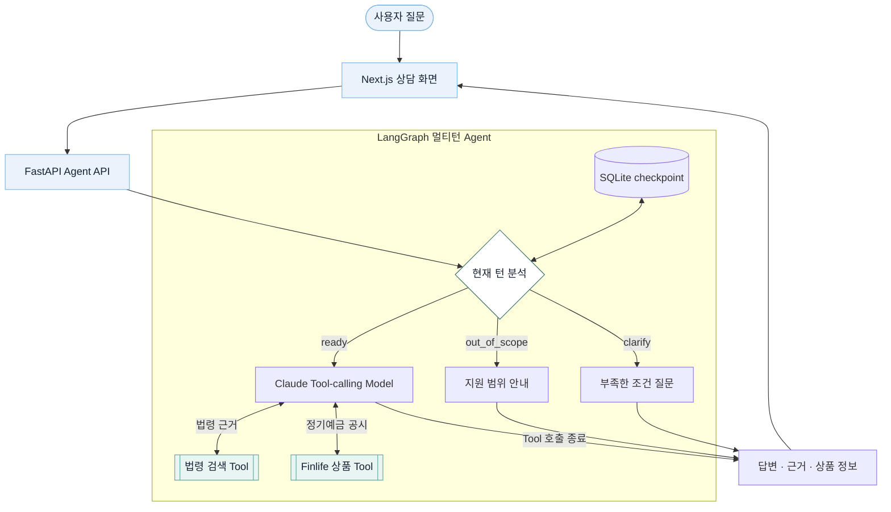

<p align="center">
  
</p>

<h1 align="center">Finbom</h1>

<p align="center">
  한국 금융 법령과 상품 정보를 근거와 함께 안내하는 멀티턴 금융 상담 Agent
</p>

<p align="center">
  <strong>한국어</strong> · <a href="README.en.md">English</a>
</p>

<p align="center">
  <a href="https://www.python.org/">
    
  </a>
  <a href="https://fastapi.tiangolo.com/">
    
  </a>
  <a href="https://docs.langchain.com/oss/python/langgraph/">
    
  </a>
  <a href="https://nextjs.org/">
    
  </a>
</p>

<p align="center">
  <a href="#근거까지-확인하는-금융-상담">프로젝트 소개</a> ·
  <a href="#핀봄이-할-수-있는-일">주요 기능</a> ·
  <a href="#질문에서-답변까지">Agent 흐름</a> ·
  <a href="#법령-데이터와-검색-근거">데이터</a> ·
  <a href="#빠르게-시작하기">실행 방법</a> ·
  <a href="docs/README.md">개발 문서</a>
</p>

---

## 근거까지 확인하는 금융 상담

금융 질문은 답을 얻는 것만큼 **어떤 자료를 근거로 답했는지 확인하는 과정**이
중요합니다. 핀봄은 예금자보호와 금융소비자 권리에 관한 법령을 검색하고, Finlife
공시에서 은행권 정기예금 후보를 비교해 답변과 근거를 함께 보여 줍니다.

상담 마스코트 **포키(Poki)** 는 개발 도구에 익숙하지 않은 사용자도 법령 조문과
상품 비교 결과를 한 흐름에서 읽을 수 있도록 안내합니다.

## 핀봄이 할 수 있는 일

- **법령 근거 안내** — 예금자보호·금융소비자 권리 질문에 관련 법령명, 조문과 시행일을
  함께 제시합니다.
- **정기예금 후보 비교** — 가입 기간과 기본금리·최고금리 기준에 따라 Finlife 공시
  상품을 정렬해 보여 줍니다.
- **멀티턴 조건 확인** — 상품 종류나 가입 기간이 부족하면 한 번에 하나씩 되묻고, 같은
  상담의 확정 조건을 SQLite checkpoint에 이어서 저장합니다.
- **법령·상품 혼합 상담** — 한 질문에 법령 근거와 상품 비교가 모두 필요하면 Agent가
  두 Tool을 선택해 결과를 함께 설명합니다.
- **지원 범위 안내** — 현재 다루지 않는 질문은 관련 없는 답을 만들지 않고
  `out_of_scope` 경로에서 상담 범위를 안내합니다.
- **근거 중심 상담 화면** — 스트리밍 답변과 처리 상태를 보여 주고, 답변·법령 근거·상품
  정보를 분리해 확인할 수 있습니다.

## 질문에서 답변까지



먼저 현재 질문과 이전 상담 조건을 분석해 `clarify`, `out_of_scope`, `ready` 중 다음
경로를 정합니다. 준비된 질문은 Claude가 법령 검색과 정기예금 조회 Tool의 사용 여부와
순서를 선택하고, Tool 결과를 확인한 뒤 최종 답변을 만듭니다. Next.js 화면은
`POST /api/chat`을 통해 FastAPI의 `/ask-agent/stream` SSE 응답을 전달받습니다.

## 법령 데이터와 검색 근거

법령 corpus는 국가법령정보 공동활용 Open API에서 수집한 XML snapshot입니다. 현재
금융소비자보호법·예금자보호법과 각 시행령, 총 4건을 사용하며 수집 기준일은
**2026-07-06**입니다.

- [법령 XML과 출처·수집 기준](data/laws/README.md)
- [버전 관리되는 법령 원문](data/laws/)
- [RAG 개발·회귀평가 Dataset](data/evaluation/README.md)

Chroma 인덱스(`data/index/`)는 원문에서 다시 만들 수 있는 로컬 산출물이므로 Git에
포함하지 않습니다. 다음 명령으로 인덱스를 만들고, 저장된 조문·청크 수와 검색 준비
상태를 직접 확인할 수 있습니다.

```bash
uv run python scripts/build_index.py
uv run python scripts/verify_index.py
```

정기예금 정보는 금융감독원 금융상품 한눈에 Finlife API의 은행권 공시를 요청 시점에
조회합니다. 상품 순서는 LLM이 임의로 정하지 않고 Python 비교 로직이 기간과 선택한
금리 기준으로 결정합니다.

## 빠르게 시작하기

Python 3.13, [uv](https://docs.astral.sh/uv/)와 Node.js 20.9 이상이 필요합니다.

### 최초 한 번 준비

```bash
cp .env.example .env  # 기존 .env가 있다면 생략
uv sync --locked
uv run python scripts/build_index.py
npm --prefix frontend ci
```

루트 `.env`의 실행 키는 한곳에서 설정합니다.

```dotenv
CHATBOT_BACKEND=anthropic
ANTHROPIC_API_KEY=<your-anthropic-api-key>
ANTHROPIC_MODEL=claude-haiku-4-5-20251001
FINLIFE_API_KEY=<your-finlife-api-key>
```

### 가장 빠른 실행

준비가 끝났다면 한 명령으로 FastAPI와 Next.js를 함께 실행할 수 있습니다.

```bash
./scripts/run.sh
```

- 상담 화면: `http://localhost:3001`
- FastAPI 문서: `http://127.0.0.1:8000/docs`
- 종료: `Ctrl+C`

### 서버를 따로 실행

각 서버의 로그를 나누어 볼 때는 두 터미널에서 실행합니다.

```bash
# terminal 1
uv run fastapi dev
```

```bash
# terminal 2
npm --prefix frontend run dev
```

## 확인해야 할 범위

- 핀봄의 답변과 표시된 법령·공시 정보는 참고용이며 법적 효력이나 법률·금융 자문을
  제공하지 않습니다. 최신 내용과 실제 가입·보호 여부는 관계 기관과 해당 금융회사에서
  다시 확인해야 합니다.
- 법령 corpus는 고정 snapshot이며 실시간 법령 동기화 기능은 아직 없습니다.
- 현재 상품 Tool은 **은행권 정기예금 비교만** 지원합니다. 적금에 관한 일반 법령 질문과
  적금 상품 공시 조회는 서로 다른 범위입니다.
- 상품 비교는 사용자가 선택한 조건에 따른 후보 안내이며 개인별 최적 상품을 판정하는
  금융상품 추천이 아닙니다.

## 다음 개선

- BM25 키워드 검색과 현재 벡터 검색을 결합한 하이브리드 검색 구현·회귀 테스트
- Finlife 적금 공시의 정규화·비교 로직과 Agent 상품 Tool 연결

평가 조건, 실험 결과와 구현 기록은 [개발 문서 허브](docs/README.md)에서 관리합니다.

## 저장소 구조

```text
korean-chatbot/
├── frontend/                 핀봄 상담 UI (Next.js, localhost:3001)
├── src/chatbot/              Agent·RAG·FastAPI
├── data/laws/                버전 관리되는 법령 XML snapshot
├── data/evaluation/          개발·회귀평가 Dataset과 fixture
├── scripts/                  실행·수집·인덱싱·검증 명령
├── tests/                    backend 단위·흐름 테스트
└── docs/                     개발·평가·설계 문서
```
초기 from-scratch Transformer 코드는 현재 주력 경로와 분리해
[experiments/from_scratch](experiments/from_scratch/README.md)에 보존되어 있습니다.
