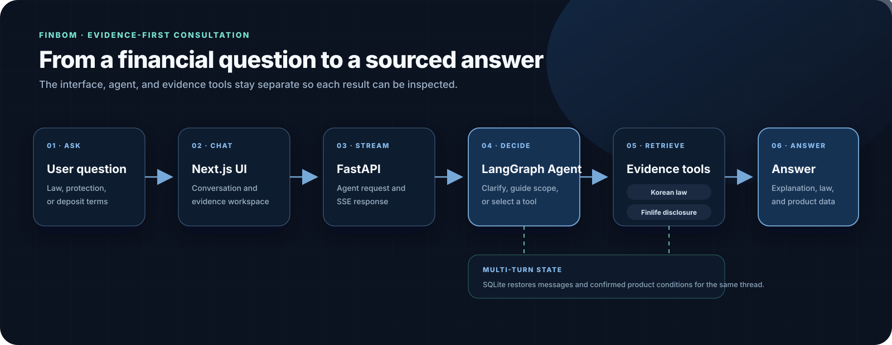

<p align="center">
  
</p>

<h1 align="center">Finbom</h1>

<p align="center">
  한국 금융 법령과 금융상품 공시를 근거로 답하는 멀티턴 금융 상담 에이전트
</p>

<p align="center">
  <strong>한국어</strong> · <a href="README.en.md">English</a>
</p>

<p align="center">
  <a href="https://www.python.org/">
    
  </a>
  <a href="https://fastapi.tiangolo.com/">
    
  </a>
  <a href="https://docs.langchain.com/oss/python/langchain/overview">
    
  </a>
  <a href="https://docs.langchain.com/oss/python/langgraph/overview">
    
  </a>
  <a href="https://nextjs.org/">
    
  </a>
</p>

<p align="center">
  <a href="#근거를-먼저-보여주는-금융-상담">소개</a> ·
  <a href="#현재-지원하는-상담">지원 기능</a> ·
  <a href="#핀봄의-작동-방식">작동 방식</a> ·
  <a href="#실행하기">실행</a> ·
  <a href="#데이터와-검증-근거">데이터·검증</a> ·
  <a href="docs/README.md">개발 문서</a>
</p>

---

## 근거를 먼저 보여주는 금융 상담

금융 질문은 답의 내용뿐 아니라 **어떤 자료를 근거로 삼았는지 확인하는 과정**이
중요합니다. **핀봄(Finbom)** 은 예금자보호와 금융소비자 권리에 관한 법령을 검색하고,
금융감독원 Finlife 공시에서 은행권 예금·적금 후보를 비교해 답변과 근거를 함께 보여 주는
금융 상담 플랫폼입니다.

상담 마스코트 **포키(Poki)** 는 핀봄의 안내자이자 대화 속 답변 화자로, 법령 조문과
상품 비교 결과를 읽기 쉽게 전달합니다.

> [!IMPORTANT]
> 핀봄이 표시하는 법령·금융상품 공시 출처와 답변은 참고용이며 법적 효력이나
> 법률·금융 자문을 제공하지 않습니다.

## 현재 지원하는 상담

- **법령 근거 확인** — 예금자보호와 금융소비자 권리에 관한 법령명, 조문과 시행일을
  답변 근거로 제시합니다.
- **예금·적금 후보 비교** — 가입 기간과 기본금리·최고금리 기준에 따라 Finlife 은행권
  공시 상품을 정렬하며, 적금은 정액·자유적립식을 함께 표시합니다.
- **대화로 조건 보완** — 상품 종류나 가입 기간이 부족하면 필요한 조건을 하나씩 묻고,
  같은 상담에서 확인된 조건을 이어서 사용합니다.
- **법령과 상품을 함께 조회** — 한 질문에 두 종류의 정보가 필요하면 관련 법령과 상품
  공시를 모두 확인합니다.
- **답변과 근거 분리 표시** — 답변을 스트리밍하고, 사용한 법령과 금융상품 정보를 별도
  영역에서 확인할 수 있습니다.

## 시스템 구성

### 요청 처리 흐름



Next.js 상담 화면은 FastAPI의 `/ask-agent/stream`으로 질문을 전달합니다. LangGraph
Agent는 이전 대화 조건을 이어받아 필요한 법령과 예·적금 공시를 조회하고, FastAPI는
답변·법령 근거·비교 상품을 SSE(Server-Sent Events)로 화면에 전달합니다.

### 포키가 답변을 만드는 과정

**질문 분석** → **필요한 조건 확인** → **법령·상품 근거 조회** → **답변과 사용 근거 표시**

조건이 부족하면 한 가지를 추가로 묻고, 지원 범위 밖의 질문에는 가능한 상담 범위를
안내합니다. 같은 상담에서 확인한 조건은 다음 질문에도 이어서 사용합니다.

> [LangGraph Agent의 분기·Tool Calling·반복 흐름 자세히 보기 →](docs/assets/finbom-agent-flow.svg)

## 실행하기

### 사전 확인

- Python 3.13과 [uv](https://docs.astral.sh/uv/)
- Node.js 20.9 이상
- [Anthropic API 키](https://console.anthropic.com/)와 금융감독원 Finlife API 키
- macOS 또는 Linux 셸 환경

법령 인덱스는 저장소의 XML 원문에서 로컬로 생성합니다. 금융상품 정보는 실행 중
Finlife API에서 조회하므로 두 API 키가 모두 있어야 전체 상담 흐름을 확인할 수 있습니다.

### 최초 한 번 준비

```bash
git clone https://github.com/SWHee/finbom-agent.git
cd finbom-agent
cp .env.example .env

uv sync --locked
uv run python scripts/build_index.py
npm --prefix frontend ci
```

루트 `.env`에서 실행 키와 생성 모델을 설정합니다.

```dotenv
CHATBOT_BACKEND=anthropic
ANTHROPIC_API_KEY=<your-anthropic-api-key>
ANTHROPIC_MODEL=claude-haiku-4-5-20251001
FINLIFE_API_KEY=<your-finlife-api-key>
```

### 한 명령으로 실행

```bash
./scripts/run.sh
```

- 상담 화면: `http://localhost:3001`
- FastAPI 문서: `http://127.0.0.1:8000/docs`
- 종료: `Ctrl+C`

### 서버를 나누어 실행

서버별 로그를 따로 확인할 때는 두 터미널에서 실행합니다.

```bash
# terminal 1
uv run fastapi dev
```

```bash
# terminal 2
npm --prefix frontend run dev
```

## 데이터와 검증 근거

법령 원문은 국가법령정보 공동활용 Open API에서 수집한 XML 스냅샷입니다. 현재
금융소비자보호법·예금자보호법과 각 시행령, 총 4건을 사용하며 수집 기준일은
**2026-07-06**입니다.

- [법령 XML 원문·출처와 수집 기준](data/laws/README.md)
- [RAG 개발·회귀평가 데이터셋](data/evaluation/README.md)

Chroma 인덱스(`data/index/`)는 법령 원문에서 다시 만들 수 있는 로컬 산출물이므로
Git에 포함하지 않습니다. 다음 명령은 저장된 조문·청크 수와 검색 준비 상태를
보여 줍니다.

```bash
uv run python scripts/verify_index.py
```

법령 검색은 KURE-v1 임베딩과 Chroma를 사용하는 의미 검색을 중심으로, 정확한 법률명과
핵심 표현을 보완하는 BM25 결과를 낮은 비중으로 결합합니다. 두 검색 목록은
RRF(Reciprocal Rank Fusion)로 합치고 같은 조문을 정리한 뒤 상위 근거를 에이전트에
전달합니다.

예금·적금 정보는 Finlife API의 은행권 공시를 요청 시점에 조회합니다. 상품 순서는
LLM이 정하지 않으며, Python 비교 로직이 가입 기간과 사용자가 선택한 금리 기준으로
결정합니다.

공개 README에서는 실험 수치를 최종 Agent 성능처럼 제시하지 않습니다. 비교 조건과
한계를 포함한 검증 기록은 다음 문서에서 확인할 수 있습니다.

- [Hybrid Search와 BM25 비교](docs/00-performance-improvement/04-retrieval-robustness/01-hybrid-search-bm25.md)
- [LangGraph 전환 전후의 RAG 회귀 기준선](docs/03-langsmith-evaluation/11-langgraph-migration-results.md)

## 지원 범위와 주의사항

- 법령 원문은 고정 스냅샷이며 실시간으로 동기화되지 않습니다.
- 현재 금융상품 조회는 **은행권 정기예금·적금 비교**를 지원합니다.
- 상품 비교는 사용자가 선택한 조건에 따른 후보 안내이며 개인별 최적 상품을 판정하는
  금융상품 추천이 아닙니다.
- 최신 법령, 실제 가입 조건과 예금자보호 여부는 관계 기관과 해당 금융회사에서 다시
  확인해야 합니다.

## 개발 문서

공개 README는 현재 실행 가능한 기능과 사용법만 다룹니다. 구현 예정 작업, 설계 결정,
평가·실험 결과, 문제 해결 기록과 회고는
[개발 문서 허브](docs/README.md)에서 역할별로 관리합니다.

## 저장소 구조

```text
finbom-agent/
├── frontend/                 핀봄 상담 UI (Next.js, localhost:3001)
├── src/chatbot/              에이전트·RAG·FastAPI
├── data/laws/                버전 관리되는 법령 XML 스냅샷
├── data/evaluation/          개발·회귀평가 데이터셋과 fixture
├── scripts/                  실행·수집·인덱싱·검증 명령
├── tests/                    백엔드 단위·흐름 테스트
└── docs/                     개발·평가·설계 문서 모음
```

초기 from-scratch Transformer 코드는 현재 애플리케이션과 분리해
[experiments/from_scratch](experiments/from_scratch/README.md)에 보존하고 있습니다.
