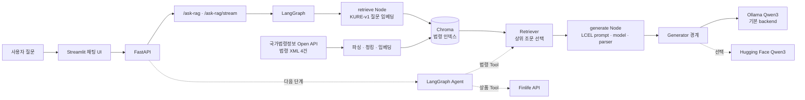

# Korean Chatbot Lab

로컬 LLM으로 한국어 금융 안내 챗봇을 만들며, 생성 모델 서빙부터 법령 RAG와
LangGraph까지 단계적으로 익히는 프로젝트입니다. 현재 법령 검색·생성 흐름의
LangGraph 전환과 회귀 평가를 마쳤고, 법령 답변을 간결하게 만드는 prompt 실험 뒤
금융상품 한눈에 API를 연결해 법령·상품·혼합 질문을 구분하는 Agent로 확장합니다.

> 이 프로젝트의 답변은 학습·시연용입니다. 최신 법령, 개별 상품의 보호 여부,
> 금융 의사결정은 반드시 공식 공시와 관계 기관 정보를 다시 확인해야 합니다.

## 한눈에 보기

| 구분 | 현재 구현 |
| --- | --- |
| 생성 모델 | Qwen3-4B-Instruct-2507 · 기본 실행은 Ollama q4_K_M |
| API | 법령 RAG의 JSON·스트리밍 요청 제공 |
| 실행 흐름 | LangGraph `retrieve → generate` · 생성 Node 안에서 LCEL 재사용 |
| RAG 데이터 | 금융소비자보호법·예금자보호법과 각 시행령, 총 4건 |
| 검색 | KURE-v1 임베딩(1024차원) · Chroma 벡터스토어 |
| 평가 | LangSmith 24문항 · LangChain/LangGraph 검색 지표 동일 · 실행 오류 0건 |
| 다음 POC | 법령 근거 유무에 따라 답변을 줄이는 RAG prompt v2 |
| 검증 | pytest와 임베딩·인덱스 재현 스크립트 |

## 아키텍처



실선은 현재 구현이고 점선은 다음 확장입니다. 현재 LangGraph는 검색과 생성의 큰
순서와 상태를 관리하고, 생성 Node는 기존 LCEL 체인을 재사용합니다. 앞으로의
Agent는 이 법령 검색 자원을 버리지 않고 Finlife 상품 조회와 함께 선택하는 상위
orchestrator 역할을 맡습니다.

## 현재 완료한 범위

- Qwen3 기반 로컬 생성기와 Ollama backend 전환
- FastAPI 법령 RAG JSON·순수 텍스트 스트리밍 API
- 법령 XML 수집, 조문 파싱, 조문 경계 기반 청킹
- KURE-v1 모델 비교·선정과 Chroma 인덱스 생성
- 질문 임베딩 → 조문 검색 → LCEL 답변 생성의 최소 RAG 흐름
- LangGraph `retrieve → generate` StateGraph와 FastAPI 연결
- Streamlit 기반 법령 RAG 채팅·스트리밍 화면
- LangSmith 24문항 LangChain 기준선과 LangGraph 전환 평가
- 전환 전후 검색 `precision_top_5=0.280`, `recall_top_5=0.711` 유지
- Finlife 인증키 환경 변수와 공식 API 정상·본문 오류 응답 계약 확인

## 다음에 이어갈 범위

다음 구현은 `src/chatbot/rag.py`의 prompt만 바꾸어 근거가 있으면 결론과 관련
조문을 제시하고, 근거가 없으면 관련 없는 조문을 나열하지 않도록 만드는
`RAG prompt v2`입니다. 검색과 Graph 구조는 유지하고 정상 질문 한 건과 근거 부족
질문 한 건을 서버 UI에서 비교합니다.

그 뒤에는 다음 순서를 따릅니다.

1. Finlife 은행권 정기예금 API 1페이지 단독 호출
2. Finlife 기본 상품과 금리 옵션을 프로젝트 내부 이름으로 정규화
3. 상품 조회 Node와 상품 답변의 한 경로 확인
4. 법령·상품·혼합·추가 정보 필요 질문을 조건부 Edge로 분기
5. 같은 두 조회 기능을 read-only Tool로 노출하고 모델의 tool calling 연결
6. Agent용 개발 Dataset을 만들고 도구 선택·인자·호출 경로·최종 답변 평가

세부 계약과 단계별 완료 기준은
[Finlife에서 LangGraph Agent까지 확장 명세](docs/07-langgraph-agent/01-finlife-agent-expansion-spec.md)에
정리합니다.

## 빠르게 실행하기

### 1. 환경 준비

Python 3.13과 [uv](https://docs.astral.sh/uv/)를 사용합니다.

```bash
uv sync --locked
```

기본 backend는 Ollama입니다. Ollama를 설치한 뒤 모델을 준비합니다.

```bash
ollama pull qwen3:4b-instruct-2507-q4_K_M
```

Finlife 연동 단계에서는 저장소에 커밋하지 않는 `.env`에 다음 키를 사용합니다.

```dotenv
FINLIFE_API_KEY=<발급받은 인증키>
```

현재 `/ask-rag` 실행에는 이 키가 필요하지 않습니다. 키는 이후 FastAPI backend에서만
읽고 Tool 인자·로그·LangSmith trace에는 포함하지 않습니다.

### 2. 법령 인덱스 만들기

저장소에는 법령 XML 원문만 포함합니다. 검색용 Chroma 인덱스는 아래 명령으로
로컬에서 생성합니다.

```bash
uv run python scripts/build_index.py
```

### 3. 서버 실행

```bash
uv run fastapi dev
```

서버와 Swagger UI는 각각 다음 주소에서 확인할 수 있습니다.

- API: `http://127.0.0.1:8000`
- Swagger UI: `http://127.0.0.1:8000/docs`

Hugging Face backend를 확인하고 싶다면 서버 실행 전에 환경 변수를 지정합니다.

```bash
CHATBOT_BACKEND=hf uv run fastapi dev
```

### 4. 채팅 UI 실행

FastAPI 서버를 켜 둔 상태에서 새 터미널을 열어 실행합니다.

```bash
uv run streamlit run streamlit_app.py
```

브라우저에서 `http://localhost:8501`을 열면 법령 RAG 답변을 채팅 형태로 확인할
수 있습니다. 화면에는 이전 메시지가 남지만, 현재 모델은 질문 사이의 문맥을 기억하지
않습니다.

## API 사용 예시

| Endpoint | 역할 | 응답 방식 |
| --- | --- | --- |
| `POST /ask-rag` | 법령 검색 후 답변과 출처 반환 | JSON |
| `POST /ask-rag/stream` | 법령 검색 후 답변을 텍스트 조각으로 전송 | plain text stream |

법령 RAG 요청:

```bash
curl -X POST http://127.0.0.1:8000/ask-rag \
  -H "Content-Type: application/json" \
  -d '{"question":"은행이 파산하면 내 예금은 얼마까지 보호받나요?"}'
```

스트리밍은 터미널에서 `-N` 옵션으로 조각 전송을 바로 확인할 수 있습니다.

```bash
curl -N -X POST http://127.0.0.1:8000/ask-rag/stream \
  -H "Content-Type: application/json" \
  -d '{"question":"예금자보호제도는 무엇인가요?"}'
```

`/ask-rag`는 답변, 검색 출처, 처리 시간을 JSON으로 함께 반환하므로 검증의 기준
endpoint로 사용합니다. `/ask-rag/stream`은 사용자가 답변을 기다리는 동안 자연스럽게
읽을 수 있도록 답변 본문만 전송합니다.

## 법령 RAG 데이터 흐름

```text
data/laws/*.xml
       │  국가법령정보 Open API에서 수집한 원문 snapshot
       ▼
statutes.py      XML을 조문(Article) 단위로 파싱
       ▼
chunking.py      조문 경계를 보존하며 긴 조문만 분할
       ▼
embedding.py     KURE-v1으로 정규화된 1024차원 벡터 생성
       ▼
build_index.py   문서·메타데이터·벡터를 Chroma에 저장
       ▼
retriever.py     질문과 가까운 청크를 찾고 조문 단위로 중복 제거
       ▼
graph.py         retrieve → generate 순서와 상태 관리
       ▼
rag.py           generate Node 안에서 LCEL로 근거 답변 생성
```

현재 인덱싱 결과는 **260개 조문에서 322개 청크**입니다. 조문이 매우 긴 경우에만
내부를 나누고, 각 청크에는 법령명·조문번호·시행일을 함께 보관합니다. 따라서
검색 결과를 답변의 근거로 다시 표시할 수 있습니다.

원문 출처, 수집 snapshot, 재수집 방법은 [data/laws/README.md](data/laws/README.md)에서
확인할 수 있습니다. Chroma 인덱스와 모델 cache는 재생성 가능한 로컬 산출물이므로
Git에 올리지 않습니다.

## 검증과 참고 문서

```bash
uv run pytest
uv run python scripts/verify_index.py
```

| 문서 | 내용 |
| --- | --- |
| [RAG 파이프라인 개요](docs/02-langchain-rag/03-guides/01-rag-pipeline-overview.md) | 코드 파일별 인덱싱·검색 흐름 |
| [외부 데이터와 API](docs/06-other/01-external-data-sources.md) | 법령 원문·금융상품 한눈에 API의 역할과 저장 기준 |
| [RAG 평가 질문](docs/03-langsmith-evaluation/02-rag-questions.md) | retrieval 평가용 질문과 정답 조문 기준 |
| [RAG 기준선 평가 순서](docs/03-langsmith-evaluation/03-rag-baseline-workflow.md) | LangGraph 전후를 같은 Dataset으로 비교하는 순서 |
| [LangChain v1 기준선 결과](docs/03-langsmith-evaluation/06-langchain-baseline-results.md) | 24문항 검색·답변 평가 결과 |
| [첫 기준선 문제 해결](docs/03-langsmith-evaluation/08-langchain-baseline-troubleshooting.md) | 첫 평가에서 겪은 오류와 확인 순서 |
| [LangGraph 전환 결과](docs/03-langsmith-evaluation/11-langgraph-migration-results.md) | 같은 24문항으로 확인한 전환 결과 |
| [LangGraph 전환 계획](docs/04-langgraph-migration/01-langgraph-migration-plan.md) | 완료된 StateGraph 전환의 원래 작업 순서 |
| [LangGraph 마이그레이션의 의미](docs/04-langgraph-migration/03-what-langgraph-migration-means.md) | Graph와 LCEL의 역할, Agent 발전 방향 |
| [RAG 응답 시간 측정 계획](docs/05-performance-improvement/01-rag-latency-baseline-plan.md) | Agent 기준선 뒤 진행할 성능 측정 |
| [Finlife·Agent 확장 명세](docs/07-langgraph-agent/01-finlife-agent-expansion-spec.md) | 현재부터 적용할 구현·평가 순서 |

계획 문서는 작성 당시의 질문을 보존하므로 미래 항목이 서로 다르게 보일 수 있습니다.
현재 우선순위는 다음과 같습니다.

| 순서 | 기준 문서 | 문서가 다루는 범위 | 현재 상태 |
| ---: | --- | --- | --- |
| 1 | [`03-rag-baseline-workflow.md`](docs/03-langsmith-evaluation/03-rag-baseline-workflow.md) | LangChain 기준선 → 같은 기능의 LangGraph 비교 | 완료 |
| 2 | [`01-langgraph-migration-plan.md`](docs/04-langgraph-migration/01-langgraph-migration-plan.md) | StateGraph 핵심 → API·스트리밍 → 24문항 재평가 | 완료 |
| 3 | [`03-rag-answer-repetition.md`](docs/05-performance-improvement/03-rag-answer-repetition.md) | 근거 유무에 따른 간결한 RAG prompt v2 | 다음 작업 |
| 4 | [`01-finlife-agent-expansion-spec.md`](docs/07-langgraph-agent/01-finlife-agent-expansion-spec.md) | Finlife 단독 호출 → 분기 → Tool Agent → Agent 평가 | prompt 실험 뒤 진행 |
| 5 | [`01-rag-latency-baseline-plan.md`](docs/05-performance-improvement/01-rag-latency-baseline-plan.md) | Agent 기준선 뒤 세부 병목 측정과 한 변수 최적화 | 대기 |

## 디렉터리 구조

```text
korean-chatbot/
├── .streamlit/config.toml       Streamlit 색상·화면 설정
├── streamlit_app.py             법령 RAG 채팅·스트리밍 UI
├── data/
│   ├── laws/                    법령 XML 원문과 출처 정보
│   ├── evaluation/              RAG 개발·회귀 평가 Dataset
│   └── index/                   로컬 Chroma 인덱스 (Git 제외)
├── docs/
│   ├── 01-chatbot-fastapi/      모델 생성과 FastAPI 단계
│   ├── 02-langchain-rag/        RAG 설계·실험·파이프라인
│   ├── 03-langsmith-evaluation/ Dataset·추적·기준선 평가
│   ├── 04-langgraph-migration/  완료된 StateGraph 전환
│   ├── 05-performance-improvement/ 응답 품질·속도 관찰과 후속 계획
│   ├── 06-other/                외부 데이터와 UI 기록
│   └── 07-langgraph-agent/      Finlife·질문 분기·Agent 확장 명세
├── scripts/
│   ├── collect_laws.py          법령 XML 수집
│   ├── build_index.py           전체 법령 인덱스 재생성
│   ├── compare_embeddings.py    임베딩 후보 비교
│   ├── verify_index.py          Chroma 검색 결과 검증
│   ├── register_evaluation_dataset.py  LangSmith Dataset 등록
│   └── run_rag_evaluation.py    LangSmith 기준선 평가 실행
├── src/chatbot/
│   ├── main.py                  FastAPI endpoint와 앱 수명주기
│   ├── generator.py             Hugging Face Qwen3 생성기
│   ├── ollama_generator.py      Ollama Qwen3 생성기
│   ├── statutes.py              XML 조문 파싱
│   ├── chunking.py              조문 경계 기반 청킹
│   ├── embedding.py             KURE-v1 임베딩
│   ├── vectorstore.py           Chroma 컬렉션 접근과 검색
│   ├── retriever.py             질문 검색과 조문 중복 제거
│   ├── rag.py                   LCEL RAG 답변 체인
│   ├── graph.py                 LangGraph 검색·생성 흐름
│   ├── evaluation.py            평가용 RAG 실행 결과 구성
│   ├── evaluators.py            검색·Faithfulness 평가
│   └── settings.py              로컬 환경 변수 로드
├── tests/                       단위·흐름 검증
└── experiments/from_scratch/    별도 보관한 Transformer 학습 실험
```

초기에 직접 구현한 Transformer 실험은 [experiments/from_scratch/](experiments/from_scratch/)에
별도로 보관합니다. 주력 FastAPI·RAG 코드와 섞지 않습니다.
