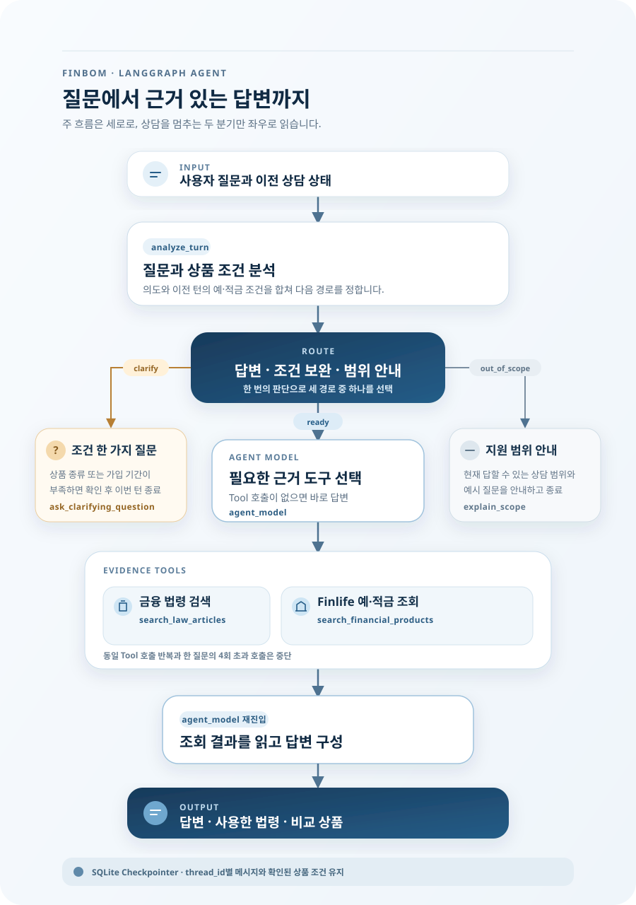
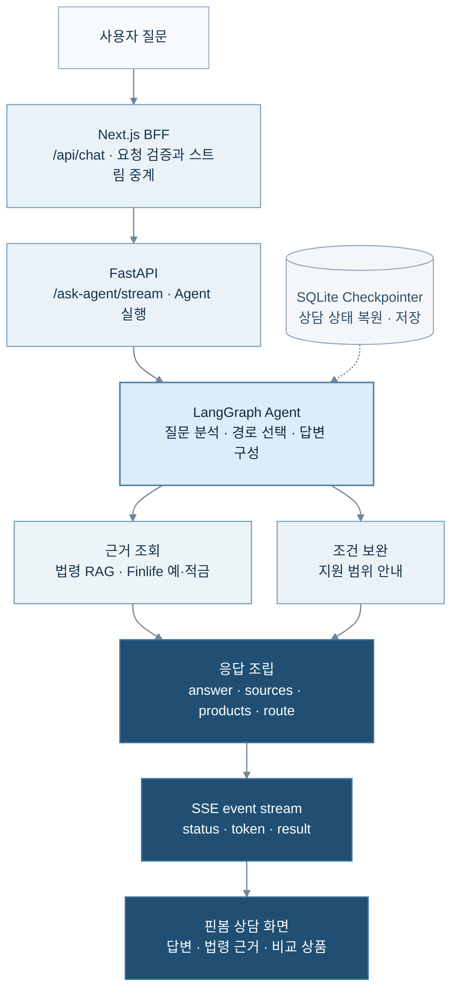
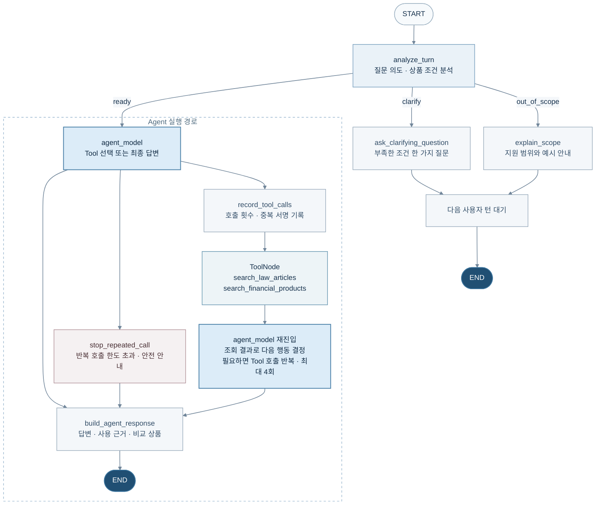

# 핀봄의 LangGraph Agent

핀봄의 Agent는 질문에 바로 답하기 전에 현재 의도와 같은 상담에서 확인한 조건을
분석합니다. 답변 가능한 질문은 법령 검색이나 Finlife 상품 조회를 거쳐, 실제 사용한
근거와 답변을 분리해 반환합니다.

> 첫 그림은 전체 구현을 노드 단위로 복제하지 않고, 상담에서 확인할 핵심 경로와 종료
> 분기만 요약합니다. 이어지는 Mermaid 다이어그램은 시스템 요청과 실제 Graph 노드를
> 각각 보완합니다.

## 핵심 흐름

- **질문 분석과 분기:** 질문 의도, 상품 조건과 추가 확인이 필요한 항목을 판단합니다.
- **조건 보완과 범위 안내:** 조건이 부족하면 한 가지만 묻고, 지원하지 않는 질문에는
  가능한 상담 범위를 안내합니다.
- **근거 조회:** 법령 검색과 Finlife 예·적금 조회 결과를 답변 근거로 사용합니다.
- **상담 상태 유지:** 메시지와 확인된 상품 조건을 `thread_id`별 SQLite Checkpointer에
  보존합니다.

## 시스템 흐름

> 여기서 Agentic RAG는 현재 구현처럼 Agent가 근거 Tool 호출 필요 여부를 판단하는 구조를
> 뜻합니다. 질의 재작성이나 검색 결과 자가평가 반복은 이 그래프에 포함하지 않습니다.

## Agentic RAG 노드 구조

세부 노드나 함수 목록보다 실제 동작과 검증 경계를 확인하려면 다음 문서를 참고합니다.

| 주제 | 문서 |
| --- | --- |
| Finlife 상품 Tool과 멀티턴 조건 | [Agent 확장 명세](01-finlife-agent-expansion-spec.md) |
| 생성 모델과 Tool 호출 경계 | [생성 모델 전환](02-generation-model-backend-transition.md) |
| 구조화 출력과 Prompt 계약 | [Claude 구조화 출력](04-claude-structured-output-and-prompt-v3.md) |
| Agent 평가 범위 | [평가 데이터셋 계약](05-agent-evaluation-dataset-contract.md) |
