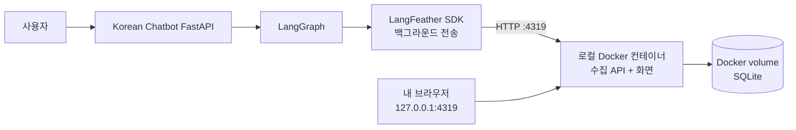

# LangFeather 로컬 추적

이 폴더는 Korean Chatbot에 LangFeather를 연결한 이유와 개인 개발 환경에서
재현하는 방법을 설명한다.

## 먼저 이해할 구조

LangSmith는 추적 데이터를 인터넷의 LangSmith 서버로 보내고, 사용자는 LangSmith
웹사이트에 로그인해 결과를 본다. LangFeather는 같은 역할을 하는 서버를 내
컴퓨터의 Docker 컨테이너로 실행한다. 그래서 브라우저를 사용한다는 점은 같지만,
접속 주소와 데이터 저장 위치가 다르다.

Docker 컨테이너가 모델을 실행하는 것은 아니다. 모델과 LangGraph는 기존 FastAPI
프로세스에서 실행되고, 컨테이너는 실행 기록을 받아 저장하고 보여주는 작은 로컬
대시보드다.

| 구분 | LangSmith | 현재 LangFeather 연결 |
| --- | --- | --- |
| 추적 서버 | 외부 hosted 서비스 | 내 컴퓨터의 Docker 컨테이너 |
| 화면 주소 | LangSmith 웹사이트 | `http://127.0.0.1:4319` |
| 로그인·API key | 필요 | 필요 없음 |
| 데이터 위치 | 외부 서비스 | 로컬 Docker volume의 SQLite |
| 현재 프로젝트 역할 | 24문항 실험·평가 | 실행 경로와 입출력 디버깅 |

LangFeather를 연결했다고 기존 LangSmith 평가가 대체되지는 않는다. 현재 버전은
`retrieve → generate` 실행 경로와 각 단계의 입출력을 가볍게 확인하는 용도다.

## 문서 순서

1. [개인 실행 안내](01-local-setup.md): 설치, 시작, 질문 전송, 화면 확인, 종료
2. [연결 및 검증 기록](02-integration-record.md): 코드 위치, 설계 판단, 확인 결과와 제약

## 현재 연결 원칙

- `LANGFEATHER_ENABLED`의 기본값은 `false`
- 활성화한 FastAPI 실행만 LangFeather로 전송
- 기존 `graph.py`, 프롬프트, 검색·생성 노드는 변경하지 않음
- 일반 응답과 스트리밍 모두 같은 최상위 그래프를 추적
- 서버 종료 시 최대 2초 동안 대기 중인 기록 전송
- LangFeather 장애가 챗봇 응답을 실패로 바꾸지 않는 best-effort 방식

추적에는 질문, 검색 문서, 생성 결과 같은 원본 데이터가 저장될 수 있다. 실제 고객
정보나 비밀값을 입력하지 않고 개인 로컬 개발 데이터로만 사용한다.
